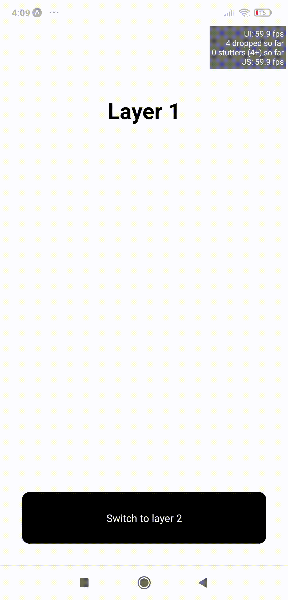

# React Native Transition View Example Apps

 

## Package
- https://www.npmjs.com/package/react-native-transition-view

 

## Run Project

1. clone repo

2. RUN: npm install or yarn (In project directory)

3. RUN: npm start or yarn start (In project directory)

 

## Video Demo

- example 1: 

